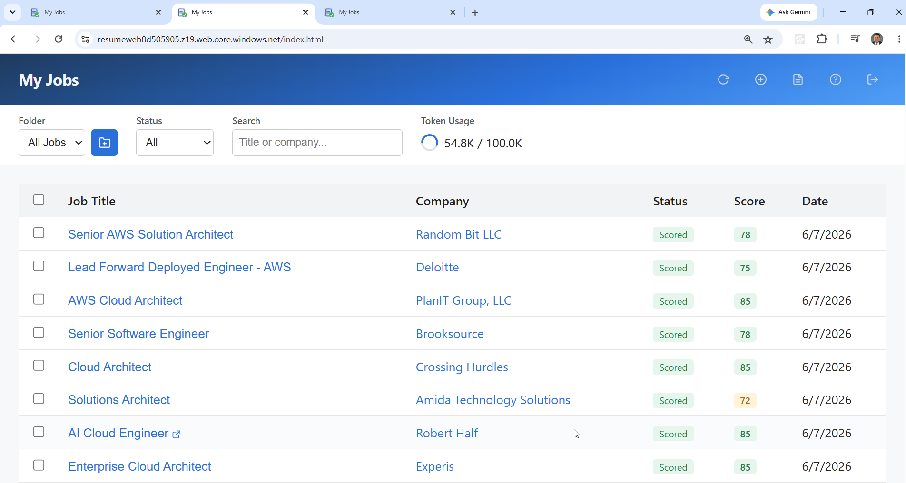
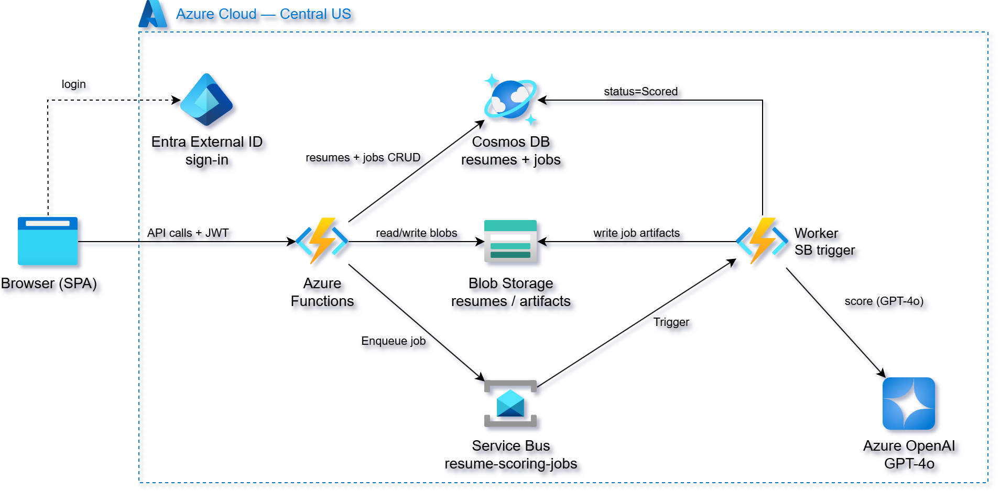

# Azure Serverless Resume Scoring Application

This project delivers a fully automated **serverless resume scoring application**
on Azure, built using **Azure Functions (Flex Consumption)**, **Azure Service Bus**,
**Cosmos DB**, **Azure Blob Storage**, and **Azure OpenAI Service (GPT-4o)**.

It uses **Terraform** and **Python** to provision and deploy an
**asynchronous, AI-powered scoring pipeline** secured with **JWT-based
authentication**, allowing users to upload resumes and submit job postings for
compatibility scoring — all without running or managing any virtual machines.

Users submit a resume and a job posting (as a URL, raw text, or LinkedIn job
ID). The application uses **Azure OpenAI GPT-4o** to extract structured job
metadata and score the resume against the job on a scale of 0–100, with a
written analysis broken into **Strengths** and **Weaknesses** sections.

Authentication and authorization are handled by **Microsoft Entra External ID**
(PKCE flow). Users click **Sign In** and are redirected to the Entra hosted
sign-in page; the resulting JWT is validated directly in the Function App code.



A **vanilla JavaScript single-page application** hosted on Azure Blob Storage
static website interacts directly with the Function App API, allowing
authenticated users to manage resumes, submit jobs for scoring, and review
AI-generated analysis from a browser.

This design follows a **serverless event-driven architecture** where the
Function App routes authenticated requests, Service Bus decouples job
submission from scoring, and Azure OpenAI handles inference on demand — with
Azure managing scaling, availability, and fault tolerance automatically.

The GPT-4o model deployment is fully parameterized — see
[Changing the Azure OpenAI Model](#changing-the-azure-openai-model). Swapping
models requires only editing one export line in `aoai-config.sh`.

## Key Capabilities Demonstrated

1. **AI-Powered Resume Scoring** – Azure OpenAI GPT-4o extracts job metadata
   and scores resume-to-job compatibility (0–100) with a written
   Strengths/Weaknesses analysis.
2. **Asynchronous Job Processing** – Service Bus decouples job submission from
   scoring. The API returns immediately with a `submitted` status while a
   Service Bus trigger processes the job in the background.
3. **Entra External ID PKCE Auth** – Login redirects to the Entra hosted UI;
   JWT validated in Function App code against the Entra JWKS endpoint. No
   API Gateway or custom auth middleware required.
4. **Managed Identity for All Services** – Function App accesses Cosmos DB,
   Service Bus, Blob Storage, and Azure OpenAI via `DefaultAzureCredential`
   with RBAC role assignments. No API keys in application settings.
5. **Serverless Event-Driven Architecture** – No VMs, containers, or VPC
   networking required. Azure Functions FC1 scale on demand and cost nothing
   at idle.
6. **Infrastructure as Code (IaC)** – Terraform provisions all resources
   across three independent phases for clean separation of concerns.
7. **Cosmos DB Data Model** – Resumes and jobs stored in separate containers
   with `{owner}_{resource_id}` document IDs for per-user data isolation.
8. **Browser-Based Frontend** – A static Blob Storage-hosted SPA uses
   sessionStorage for the Entra token and polls `GET /jobs` (5 s auto-refresh)
   to surface scoring results.

## Architecture



## Prerequisites

* [An Azure Subscription](https://portal.azure.com/) with billing enabled
* [Install Azure CLI](https://learn.microsoft.com/en-us/cli/azure/install-azure-cli)
* [Install Terraform](https://developer.hashicorp.com/terraform/install)
* [Install jq](https://jqlang.github.io/jq/download/)
* [Install zip](https://gnuwin32.sourceforge.net/packages/zip.htm) (or equivalent)
* [Install envsubst](https://www.gnu.org/software/gettext/) (part of `gettext`)
* A **service principal** with `Contributor` + `User Access Administrator`
  roles on the subscription (for Terraform + RBAC assignments)
* A **Microsoft Entra External ID tenant** with a self-service sign-up user
  flow configured

## Required Environment Variables

Export the following before running any scripts:

```bash
# Azure service principal — used by Terraform (azurerm provider)
export ARM_CLIENT_ID="<sp-client-id>"
export ARM_CLIENT_SECRET="<sp-client-secret>"
export ARM_TENANT_ID="<arm-tenant-id>"
export ARM_SUBSCRIPTION_ID="<subscription-id>"

# Entra External ID tenant — used by Terraform (azuread provider) and
# apply.sh (Graph API user flow association)
export ENTRA_TENANT_ID="<external-tenant-id>"
export ENTRA_TENANT_NAME="<external-tenant-name>.onmicrosoft.com"
export ENTRA_SP_CLIENT_ID="<entra-sp-client-id>"
export ENTRA_SP_CLIENT_SECRET="<entra-sp-client-secret>"
export ENTRA_USER_FLOW_NAME="<user-flow-display-name>"
```

The ARM and ENTRA service principals may be the same SP if it has access to
both tenants, or different SPs scoped to their respective tenants.

## Download this Repository

```bash
git clone https://github.com/mamonaco1973/azure-resume-app.git
cd azure-resume-app
```

## Build the Code

Run [check_env.sh](check_env.sh) to validate your environment, then run
[apply.sh](apply.sh) to provision all infrastructure and deploy the frontend.

```bash
~/azure-resume-app$ ./apply.sh
NOTE: Running environment validation...
NOTE: Validating that required commands are found in your PATH.
NOTE: az is found in the current PATH.
NOTE: terraform is found in the current PATH.
NOTE: jq is found in the current PATH.
NOTE: zip is found in the current PATH.
NOTE: envsubst is found in the current PATH.
NOTE: All required environment variables are set.
NOTE: Azure login successful.
NOTE: Entra user flow found: <user-flow-display-name>
NOTE: Deploying backend infrastructure...
NOTE: Deploying Function App...
NOTE: Packaging and deploying function code...
NOTE: Generating frontend config...
NOTE: Deploying web app...

=================================================================================
  Resume Scorer — Deployment validated!
=================================================================================
  API : https://resume-func-<hex>.azurewebsites.net/api
  App : https://resumeweb<hex>.z9.web.core.windows.net/index.html
=================================================================================
```

`apply.sh` performs the following steps in order:

1. Sources `aoai-config.sh` to set `AOAI_MODEL_DEPLOYMENT`
2. Runs `check_env.sh` to validate CLI tools, env vars, Azure login, and Entra
   user flow connectivity
3. Runs `terraform apply` on `01-backend` — provisions Service Bus, Cosmos DB,
   Blob Storage accounts, Azure OpenAI, and Entra app registration
4. Associates the Entra app registration with the user flow via Graph API
   (retried up to 10 times)
5. Runs `terraform apply` on `02-functions` — deploys the Function App,
   Application Insights, and all RBAC role assignments
6. Packages `02-functions/code/` as a zip and deploys it to the Function App
   (retried up to 10 times for SCM initialization)
7. Generates `03-webapp/site/js/config.js` (ES module) and
   `03-webapp/site/config.json` (PKCE callback config) from Terraform outputs
8. Runs `terraform apply` on `03-webapp` — uploads all site files to the
   `$web` container of the web storage account
9. Runs `validate.sh` to print the live URLs

### Build Results

When the deployment completes, the following resources are created:

- **Core Infrastructure:**
  - Fully serverless architecture — no VMs, containers, or VPC networking
  - Three independent Terraform state phases for clean separation of concerns
  - Asynchronous scoring pipeline decoupled via Service Bus

- **Security, Identity & Access Management:**
  - **Microsoft Entra External ID** — managed PKCE sign-in with hosted UI;
    no custom login form in the app
  - JWT validated in Function App code against the Entra JWKS endpoint; no
    API Gateway or custom auth middleware
  - **Managed identity** for Function App with RBAC assignments to all
    downstream services — no API keys stored in application settings
  - Dedicated service principal for Terraform; separate SP scoped to the
    Entra External tenant for Graph API calls

- **Azure Cosmos DB:**
  - Account: `cosmos-resume-{hex}` (SQL API, serverless-compatible)
  - Database: `resume-app`
  - Container `resumes` — partition key `/owner`; no TTL (resumes kept
    indefinitely)
  - Container `jobs` — partition key `/owner`; default TTL 90 days
  - Document IDs: `{owner}_{resource_id}` for per-user data isolation
  - Custom RBAC role with full read/write permissions (no Cosmos master key
    stored anywhere)

- **Azure Functions (Flex Consumption FC1):**
  - Single `function_app.py` with all HTTP routes and the Service Bus trigger
  - Python 3.11, 2048 MB instance memory, up to 10 concurrent instances
  - JWT extracted from `Authorization: Bearer` header; `sub` claim used as
    Cosmos DB partition key
  - **Resume CRUD routes:** POST/GET/PUT/DELETE `/resumes` and
    `/resumes/{resume_id}`
  - **Job routes:** POST/GET/DELETE `/jobs` and `/jobs/{job_id}` + PATCH
    `/jobs/{job_id}/notes`
  - **`resume_scoring_worker`** — Service Bus trigger; fetches URL or reads
    raw text, strips HTML, runs two-phase GPT-4o scoring, writes blobs,
    updates Cosmos

- **Azure Service Bus Standard:**
  - Namespace: `sb-resume-{hex}` (RBAC-only auth, no connection strings)
  - Queue: `resume-scoring-jobs` (lock 5 min, TTL 90 days, max delivery 5)
  - Function App holds both `Azure Service Bus Data Sender` and
    `Azure Service Bus Data Receiver` roles

- **Azure OpenAI Service:**
  - Account: `resume-aoai-{hex}` (kind=OpenAI, S0, custom subdomain required
    for managed identity auth)
  - Deployment: `gpt-4o` (version 2024-11-20, GlobalStandard, 100K TPM)
  - Two-phase scoring: extraction call → scoring call; both use
    `response_format={"type": "json_object"}` for reliable JSON output
  - Function App holds `Cognitive Services OpenAI User` role
  - 429 rate-limit backoff: 10 s → 20 s → 40 s

- **Azure Blob Storage:**
  - **Web account** (`resumeweb{hex}`) — static website hosting for the SPA
  - **Media account** (`resumemedia{hex}`) — private; accessed server-side
    via managed identity (`Storage Blob Data Contributor`):
    ```
    resumes/{owner}/{resume_id}.txt
    jobs/{owner}/{job_id}/resume_snapshot.txt
    jobs/{owner}/{job_id}/job_description.txt
    jobs/{owner}/{job_id}/job_analysis.txt
    jobs/{owner}/{job_id}/notes.txt
    ```

- **Static Web Application (Blob Storage `$web`):**
  - Vanilla JavaScript SPA with no build step or framework dependencies
  - Entra PKCE: Sign In redirects to Entra hosted UI; `callback.html`
    completes the code exchange and stores the id_token in sessionStorage
  - `config.js` (ES module) and `config.json` (PKCE callback) generated at
    deploy time — never edited directly
  - Polls `GET /jobs` every 5 s while any job is pending

## Function App API Endpoints

All endpoints require `Authorization: Bearer <JWT>` issued by Entra External ID.
CORS is restricted to the web storage static website origin.

### Resumes

| Method | Path | Purpose |
|--------|------|---------|
| POST | `/api/resumes` | Upload a new resume |
| GET | `/api/resumes` | List all resumes for the authenticated user |
| GET | `/api/resumes/{resume_id}` | Retrieve a resume with full text |
| PUT | `/api/resumes/{resume_id}` | Replace a resume name and text |
| DELETE | `/api/resumes/{resume_id}` | Delete a resume and its blob |

### Jobs

| Method | Path | Purpose |
|--------|------|---------|
| POST | `/api/jobs` | Submit a job for scoring (URL or raw text) |
| GET | `/api/jobs` | List all jobs for the authenticated user |
| GET | `/api/jobs/{job_id}` | Retrieve a job with score and analysis |
| PATCH | `/api/jobs/{job_id}/notes` | Update user notes on a job |
| DELETE | `/api/jobs/{job_id}` | Delete a job and all associated blobs |

### Request & Response Characteristics

| Aspect | Behavior |
|--------|----------|
| Authentication | Entra External ID JWT (Bearer) |
| Authorization | Enforced via Cosmos DB document `owner` field |
| Identity Source | JWT `sub` claim |
| Content Type | `application/json` |
| Timestamps | ISO 8601 strings |
| Error Handling | Standard HTTP status codes with `{"error": "..."}` body |

---

### POST /api/resumes

**Purpose:** Upload a resume for use in job scoring.

**Request Body (JSON):**
```json
{
  "name": "Software Engineer Resume",
  "resume": "Full resume text goes here..."
}
```

**Example Response (200):**
```json
{
  "resume_id": "a1b2c3d4-1234-5678-abcd-ef1234567890",
  "name": "My Resume"
}
```

---

### POST /api/jobs

**Purpose:** Submit a job posting for AI scoring. Returns immediately with
`submitted` status while scoring runs asynchronously via Service Bus.

**Request Body (JSON) — URL source:**
```json
{
  "resume_id": "a1b2c3d4-...",
  "source_type": "url",
  "job_url": "https://www.linkedin.com/jobs/view/1234567890"
}
```

**Request Body (JSON) — Raw text source:**
```json
{
  "resume_id": "a1b2c3d4-...",
  "source_type": "raw_text",
  "job_description": "We are looking for a Senior Python Engineer..."
}
```

**Example Response (200):**
```json
{
  "job_id": "b2c3d4e5-1234-5678-abcd-ef1234567890",
  "status": "submitted",
  "status_message": "Job submitted for scoring"
}
```

**Job Status Values:**

| Status | Meaning |
|--------|---------|
| `submitted` | Job queued, worker not yet started |
| `Scoring` | Worker is actively processing |
| `Scored` | Scoring complete, results available |
| `Failed` | Processing failed, see `status_message` |

---

### GET /api/jobs/{job_id}

**Purpose:** Retrieve a scored job with full analysis. Poll this endpoint
after submission until `status` is `Scored` or `Failed`.

**Example Response (200):**
```json
{
  "job_id": "b2c3d4e5-...",
  "job_title": "Senior Python Engineer",
  "company": "Acme Corp",
  "status": "Scored",
  "score": 78,
  "job_analysis": "Overview: ...\n\nStrengths: ...\n\nWeaknesses: ...",
  "job_description": "We are looking for...",
  "resume_snapshot": "John Smith...",
  "notes": "",
  "created_at": "2025-05-04T12:30:00Z",
  "updated_at": "2025-05-04T12:30:35Z"
}
```

---

## Changing the Azure OpenAI Model

The model deployment name is parameterized end-to-end. To retarget, edit the
`export` line in [aoai-config.sh](aoai-config.sh) — sourced by both `apply.sh`
and `destroy.sh`:

```bash
export AOAI_MODEL_DEPLOYMENT="gpt-4o"
```

This value flows automatically to:

- **`01-backend/` Terraform** — provisions the cognitive deployment with this
  name and version
- **`02-functions/` Terraform** — sets the `AOAI_MODEL_DEPLOYMENT` app setting
  on the Function App
- **`02-functions/code/function_app.py`** — reads `AOAI_MODEL_DEPLOYMENT` at
  runtime and passes it to the Azure OpenAI SDK

If the new model uses a different response schema, also update the prompt
strings in [02-functions/code/function_app.py](02-functions/code/function_app.py).

## Destroy

```bash
./destroy.sh
```

Tears down all infrastructure provisioned by `apply.sh`. The destroy script:

1. Reads all outputs from `01-backend` Terraform state
2. Destroys `03-webapp` (removes blobs from `$web` container)
3. Destroys `02-functions` (Function App, RBAC assignments)
4. Removes the Entra app association from the user flow via Graph API
5. Destroys `01-backend` (Service Bus, Cosmos DB, Storage, AOAI, Entra app)

## Using the Application

Once deployed, open the **App URL** printed by `validate.sh` in your browser.

### 1. Sign In

Click **Sign In**. You are redirected to the **Entra External ID hosted sign-in
page**. On first use, choose **Sign Up**, enter your email address and a
password, then complete email verification if required.

After sign-in you are redirected back to the dashboard via `callback.html`,
which completes the PKCE code exchange and stores the id_token in sessionStorage.

### 2. Add a Resume

Before scoring any jobs you need at least one resume on file.

1. Click **Manage Resumes**.
2. Click **New Resume**, give it a name (e.g. `Software Engineer Resume`), and
   paste the full plain-text content of your resume into the text area.
3. Click **Create Resume**. The resume text is stored in Blob Storage and the
   metadata in Cosmos DB.

You can create multiple resumes (e.g. one tailored for backend roles, one for
management) and choose between them at scoring time.

### 3. Score a Job

1. Click **Score New Job**.
2. Select the resume to score against from the **Resume** dropdown.
3. Choose a **Source Type**:

   | Source Type | When to use |
   |-------------|-------------|
   | **Job URL** | Paste a direct link to any publicly accessible job posting |
   | **Paste Job Description** | Paste raw job description text — useful when a URL requires login |
   | **LinkedIn Job IDs** | Enter one or more numeric LinkedIn job IDs (one per line) for batch submission |

4. Click **Submit**. The job is queued in Service Bus and the modal closes.

### 4. Monitor Scoring Progress

While a job is being processed:

- The **Status** badge shows `submitted` or `Scoring`.
- A **spinner and countdown** appear in the toolbar — the list auto-refreshes
  every 5 seconds until all pending jobs reach a terminal state.
- Click **Refresh** at any time to poll immediately.

Scoring typically takes **20–90 seconds** depending on Azure OpenAI response
time and whether the job URL requires fetching and HTML parsing.

### 5. View the Analysis

Once the status changes to **Scored**, click **Open** to view the full result:

- **Score** — a 0–100 compatibility rating
- **Analysis** — Overview, Strengths, and Weaknesses sections generated by
  GPT-4o
- **Job Description** — the cleaned job text used for scoring
- **Resume Snapshot** — the version of your resume captured at submission time
  (edits to the resume afterwards do not affect past scores)

### 6. Add Notes

On the job detail page you can type personal notes (interview prep, recruiter
contact details, application status) into the **Notes** field and save them.
Notes are stored in Blob Storage and are private to your account.

### 7. Delete Jobs

Click **Delete** on any row in the dashboard to permanently remove the job
record and all associated blobs. This action cannot be undone.
